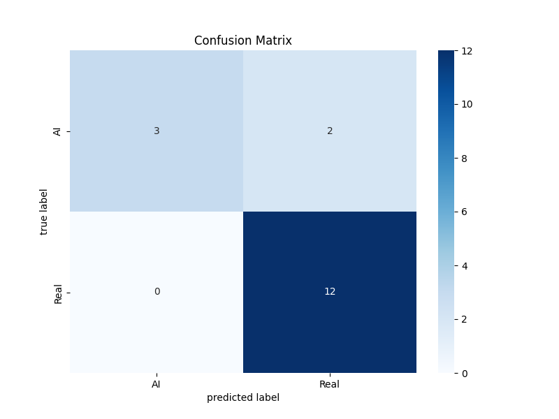

# AI vs. Real Image Classifier

This project contains a machine learning model and a Gradio web application to classify images as either AI-generated or real. It utilizes Python, the Hugging Face Transformers library, PyTorch for model training and inference, and Gradio for the interactive user interface.
The system is designed to help distinguish between photographic images and images created by artificial intelligence.

## Key Technologies:
*   Python
*   PyTorch
*   Hugging Face Transformers
*   Gradio
*   Scikit-learn
*   Pillow (PIL)
*   Matplotlib & Seaborn (for metrics visualization)

## Project Structure

Here's a brief overview of the key files and directories:

*   **`main.py`**: The main script for training the image classification model. It handles data loading, preprocessing, model training using PyTorch/Transformers, evaluation, and saving the trained model.
*   **`app.py`**: A Gradio web application that loads the trained model and provides an interactive interface for users to upload images and get predictions (AI-generated or real).
*   **`preprocess_images.py`**: A utility script to convert images in the dataset (especially HEIC/HEIF formats) to JPEG format. This is often a necessary step before training.
*   **`inference.py`**: A simple Python script for performing command-line inference with the trained model on a single image.
*   **`ai_vs_real_classifier/`**: This directory is created during training (by `main.py`) and stores the trained model files. `app.py` loads the model from here.
*   **`人工智慧第四組資料夾/`**: This is the expected root directory for the training dataset. It should contain two subdirectories:
    *   `ai/`: For AI-generated images.
    *   `real/`: For real photographic images.
*   **`confusion_matrix.png`**: An image file generated after training by `main.py`, showing the confusion matrix of the model's performance on the test set.
*   **`pyproject.toml`**: Defines project metadata and dependencies.
*   **`.python-version`**: Specifies the Python version for the project.
*   **`README.md`**: This file, providing information about the project.

## Setup and Installation

1.  **Clone the repository:**
    ```bash
    git clone <repository-url> # Replace <repository-url> with the actual URL
    cd <repository-directory>
    ```

2.  **Python Version:**
    This project uses Python 3.12. It's recommended to use a virtual environment (e.g., venv, conda).
    ```bash
    python -m venv venv
    source venv/bin/activate  # On Windows: venv\Scripts\activate
    ```

3.  **Install Dependencies:**
    The project dependencies are listed in `pyproject.toml`. You can install them using `pip`:
    ```bash
    pip install transformers torch torchvision torchaudio gradio Pillow scikit-learn matplotlib seaborn
    ```
    For GPU support with PyTorch (recommended for training and faster inference), follow the instructions on the [official PyTorch website](https://pytorch.org/get-started/locally/) to install the version compatible with your CUDA setup.

4.  **Optional: HEIC/HEIF Support:**
    The `preprocess_images.py` script can convert HEIC/HEIF images. To enable this, you need to install `pillow-heif`:
    ```bash
    pip install pillow-heif
    ```
    You might also need to install system libraries for `libheif`:
    *   On Debian/Ubuntu: `sudo apt-get install libheif1 libde265-0`
    *   On macOS (using Homebrew): `brew install libheif`

## Data Preparation

The model is trained to classify images as either AI-generated or real. You'll need to prepare your dataset accordingly:

1.  **Dataset Directory Structure:**
    Create a root folder for your dataset. By default, the training script (`main.py`) expects this folder to be named `人工智慧第四組資料夾` (as seen in the script) and located in the project's root directory. Inside this folder, create two subdirectories:
    *   `ai/`: Place all your AI-generated images in this folder.
    *   `real/`: Place all your real photographic images in this folder.

    The structure should look like this:
    ```
    <project-root>/
    ├── 人工智慧第四組資料夾/
    │   ├── ai/
    │   │   ├── image1.jpg
    │   │   ├── image2.png
    │   │   └── ...
    │   └── real/
    │       ├── image3.jpg
    │       ├── image4.jpeg
    │       └── ...
    ├── main.py
    ├── app.py
    └── ...
    ```

2.  **Image Formats & Preprocessing:**
    The training script processes images using the Pillow library. While it can handle various formats, it's recommended to have images in common web formats like JPEG or PNG.
    If you have images in HEIC/HEIF format, or other formats that need conversion, you can use the `preprocess_images.py` script.
    *   Ensure you have installed `pillow-heif` as described in the "Setup and Installation" section if you need to process HEIC/HEIF files.
    *   Modify the `DATA_DIRECTORY` variable at the bottom of `preprocess_images.py` if your dataset folder is named differently or located elsewhere.
    *   Run the script from the project root:
        ```bash
        python preprocess_images.py
        ```
    This will convert images (e.g., HEIC to JPEG) and place them in the same directory structure, potentially overwriting originals if configured to do so (the script defaults to deleting originals after successful conversion if the new file has a different name or was an HEIF). Review the script's behavior if you have concerns about original files.

## Training the Model

Once your dataset is prepared and dependencies are installed, you can train the image classification model:

1.  **Run the Training Script:**
    Execute the `main.py` script from the project's root directory:
    ```bash
    python main.py
    ```

2.  **Training Process:**
    *   The script will load images from the specified data directory (`./人工智慧第四組資料夾/` by default).
    *   It uses a Vision Transformer model (e.g., `google/vit-large-patch16-224-in21k`) pre-trained on ImageNet, and fine-tunes it on your dataset.
    *   A Focal Loss function is implemented to help address potential class imbalance between 'AI' and 'real' images.
    *   The script will output training progress, including loss and evaluation metrics (accuracy, F1-score, precision, recall) for each epoch if a validation set is created.
    *   The training arguments (like number of epochs, batch size, etc.) are defined within `main.py` and can be adjusted if needed.

3.  **Output:**
    *   **Trained Model:** The best performing model (based on F1-score on the validation set) will be saved to the `./ai_vs_real_classifier/` directory. This directory will contain files like `pytorch_model.bin`, `config.json`, etc.
    *   **Confusion Matrix:** A visual representation of the model's performance on the test set, `confusion_matrix.png`, will be saved in the project's root directory.

**Note on Resources:** Training deep learning models, especially large ones like Vision Transformers, can be computationally intensive and may require a GPU for reasonable training times. The script is configured to use mixed-precision training (`bf16=True`) and PyTorch 2.0 compilation (`torch_compile=True`) if available, which can speed up training and reduce memory usage on compatible hardware.

## Usage (Inference)

Once the model is trained and saved, you can use it to classify new images.

### 1. Web Application (Gradio)

The primary way to interact with the classifier is through the Gradio web application:

*   **Run the App:**
    Execute the `app.py` script from the project's root directory:
    ```bash
    python app.py
    ```
*   **Using the Interface:**
    *   The script will typically print a local URL to your console (e.g., `Running on local URL:  http://127.0.0.1:7860`). Open this URL in your web browser.
    *   You'll see an interface titled "Custom Image Classifier".
    *   Upload an image using the provided upload box.
    *   The model will process the image, and the predicted label ("AI" or "Real") along with confidence scores for the top classes will be displayed.
    *   The app includes some example image paths (`test_image_0.jpg`, `test_image_1.png`, etc.). Ensure these example images exist if you want to use the example buttons in the Gradio interface, or update the paths in `app.py`.

### 2. Command-Line Inference (Basic)

For a simpler, non-interactive way to get a prediction for a single image, you can use `inference.py`:

*   **Prepare an image:** Place an image you want to test (e.g., `my_test_image.jpg`) in the project's root directory, or provide the correct path to it.
*   **Modify `inference.py` (if needed):**
    *   The script is currently set to load the model from `./outputs`. **Important:** The training script `main.py` saves the model to `./ai_vs_real_classifier`. You will likely need to change the `model` path in `inference.py` from `"./outputs"` to `"./ai_vs_real_classifier"` to use your trained model.
    *   Update the image path `Image.open("test_image.jpg")` to `Image.open("your_image_name.jpg")`.
*   **Run the script:**
    ```bash
    python inference.py
    ```
*   The script will print the raw prediction output (a list of dictionaries with labels and scores) to the console.

**Note:** The Gradio application (`app.py`) is the recommended way for most users to perform inference due to its user-friendly interface and correct model path configuration by default (it loads from `./ai_vs_real_classifier`).

## Model Information

*   **Base Model:** The classification model is based on the Vision Transformer (ViT) architecture. Specifically, the `main.py` script is configured to use `"google/vit-large-patch16-224-in21k"` as the starting point. This model is pre-trained on the ImageNet-21k dataset.
*   **Fine-Tuning:** The pre-trained ViT model is then fine-tuned on the custom "AI vs. Real" image dataset provided by the user.
*   **Output Layer:** The number of labels for the classification head is set to 2 (e.g., "AI" and "Real"). The `id2label` mapping is `{0: "AI", 1: "Real"}` and `label2id` is `{"AI": 0, "Real": 1}`.
*   **Loss Function:** To handle potential class imbalance in the dataset (where one class might have significantly more images than the other), a **Focal Loss** function is implemented in `main.py` and used during training. This helps the model pay more attention to hard-to-classify examples and down-weights the loss assigned to well-classified examples. The `alpha` parameter of the Focal Loss is dynamically calculated based on the inverse class frequencies in the training data.
*   **Performance:** The `main.py` script computes and logs various metrics during validation and testing, including accuracy, F1-score, precision, and recall. A confusion matrix is also generated and saved as `confusion_matrix.png`.

## Model Performance Visualization

After a successful training run using `python main.py`, a confusion matrix image named `confusion_matrix.png` is saved to the project's root directory.

This image visually represents the model's performance by showing the counts of true positive, true negative, false positive, and false negative predictions on the test set.

**Viewing the Confusion Matrix:**

*   You can open the `confusion_matrix.png` file directly from your file explorer.
*   If this README is being viewed on a platform that renders Markdown and can access local images (e.g., when the repository is hosted on GitHub), the image can be embedded directly.

**(Note: The image will only be visible below if `confusion_matrix.png` exists in the root of the repository and the Markdown viewer supports relative image paths.)**



## To-Do / Future Work

Here are some potential areas for future improvement and development:

*   **`requirements.txt`:** Create a `requirements.txt` file for easier pip-based dependency management, in addition to `pyproject.toml`.
*   **Configuration File:** Move hardcoded paths (like dataset directory in `main.py` and `preprocess_images.py`) and training parameters (epochs, batch size in `main.py`) into a configuration file (e.g., YAML or JSON) for easier modification without altering the code.
*   **Expanded Model Evaluation:** Implement more detailed evaluation, such as per-class metrics if more categories are added, or ROC curves and AUC scores.
*   **Model Checkpointing Options:** Provide more flexible model checkpointing strategies during training (e.g., save best N models, save every K epochs).
*   **Data Augmentation:** Explore and implement more sophisticated data augmentation techniques during training to improve model generalization.
*   **Error Handling:** Enhance error handling and logging in the scripts.
*   **Testing:** Add unit tests for preprocessing, training, and inference components.
*   **Packaging:** Package the application for easier distribution (e.g., using Docker).
*   **UI Enhancements:** Add more features to the Gradio UI, such as displaying example predictions or allowing adjustment of inference parameters.
